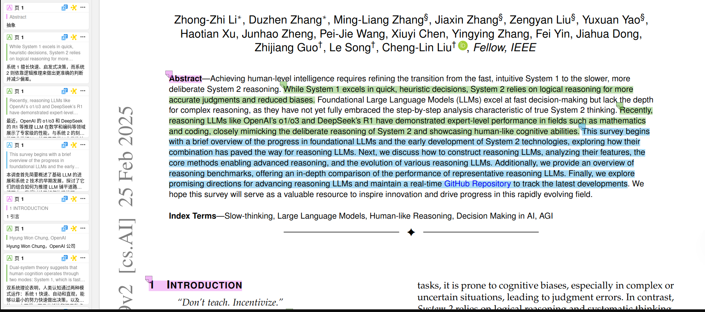
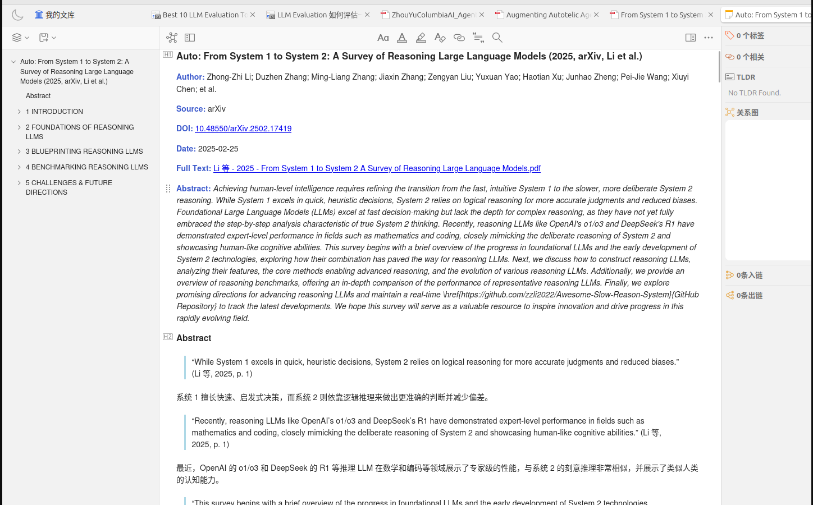
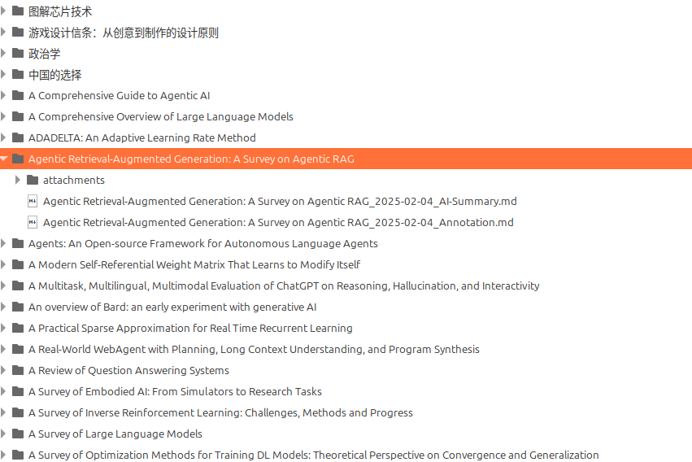

English | [中文](README_zh.md)

# Zotero AI Workflow
This repository provides a set of automated workflows based on Zotero, including summary generation, Q&A, and note generation-update-export capabilities. The workflow components depend on [zotero-actions-tags](https://github.com/windingwind/zotero-actions-tags) and are implemented as JavaScript scripts.

## Zotero Workflow Summary
Here's our basic workflow with Zotero:
- When items are added to the library
    - [Auto] Add #To-Read tag
    - [Manual] Add tags like #To-More-Read
- When opening an item
    - [Auto] Translate abstract
    - [Auto] Generate AI summary, save to note
- When reading an item
    - [Manual] Read AI summary
    - [Manual] Add annotations
    - [Interactive] Interact with AI for PDF Q&A, save to note
- When closing an item
    - [Auto] Generate notes based on annotations
    - [Auto] Remove #To-Read tag
    - [Manual] Remove #To-More-Read tag
- When starting Zotero program and opening main window
    - [Auto] Update notes → local markdown, sync with external note software (like wolai); update once every 7 days
    - [Interactive] Interact with AI for library-level Q&A, save to note

## Quick Start
1. After downloading the repository, start the parser server: `nohup python parse_server.py &`
2. Depends on better-notes and actions-tags plugins. Configure these templates and scripts as needed.
3. Copy `cp config_example.json config.json`, and configure server address, model API, etc. Note that you need to modify the configuration path, template name, etc. in the code.
4. [Optional] Configure prompts for model input.
Then trigger these scripts in Zotero.

## Core Logic
This repository provides the following scripts; each function is an independent script that can be used separately.

| Script File | Description |
|-------------|-------------|
| zotero_autoupdate_notes.js | Update notes generated from specified templates |
| zotero_note_template.js | Template for converting annotations to notes, supports hierarchical header extraction |
| zotero_pdf_summary.js | LLM-generated summary |
| zotero_pdf_qa.js | LLM Q&A |
| zotero_export_note.js | Export notes to files for syncing with external software |

## Configuration

config.json is used to configure server address, model API, and other information.
```
{
    "server": { 
        "url": "http://127.0.0.1:13210",
        "timeout": 30
    },
    "llm": {
        "openaiBaseUrl": "https://dashscope.aliyuncs.com/compatible-mode/v1",
        "modelName": "qwen-plus-latest",
        "apiKey": "sk-xx",
        "temperature": 0.8
    },
    "summary": {
        "chunkSize": 64000,
        "chunkOverlap": 1000,
        "maxChunk": 50,
        "only_link_file": false,
        "support_item_types": [
            "preprint",
            "journalArticle",
            "magazineArticle",
            "conferencePaper",
            "manuscript",
            "thesis"
        ]
    },
    "qa": {
        "saveColelctionKey":  "IV5MQ9HV"
    }
}
```
- **`serverUrl`**: Server address for parsing PDF files and converting summaries from markdown to html.
- **llm**: LLM-related information
- **`chunkOverlap`**: The overlap size between chunks in the map-reduce approach.
- **`only_link_file`**: For use with [ZotMoov](https://github.com/wileyyugioh/zotmoov) or [ZotFile](https://github.com/jlegewie/zotfile). If you use these or similar plugins to save paper PDFs as Zotero's "Link to File", set `only_link_file` to `true`; otherwise, set it to `false`.
- **support_item_types**: Item types supported for summary generation
- **saveColelctionKey**: Collection key where Q&A results are saved

The prompts folder contains configuration files for model input prompts.
- **`stuffPrompt`**: Prompt used when the PDF document doesn't exceed the model's context limit.
- **`mapPrompt`**: Prompt used in the map phase of the map-reduce approach. Used when the PDF document exceeds the model's context, splitting the PDF into multiple chunks, summarizing each chunk (map), and then combining with LLM interaction (reduce).
- **`reducePrompt`**: Prompt used in the reduce phase of the map-reduce approach.

## Generate Notes from Annotations
The official Zotero functionality for converting annotations to notes doesn't support hierarchical header extraction. Currently, we solve this problem by using special color annotations for headers. A more elegant solution would be automatic identification and filling [TODO].

You need to install the better-notes plugin; zotero_note_template.js serves as the note template. zotero_autoupdate_notes.js is an action-tags script that automatically updates notes.



## LLM Summary Generation
zotero_pdf_summary.js

Use LLM to automatically summarize papers and generate notes in Zotero.

When opening a paper in Zotero, zotero-actions-tags triggers a JavaScript script that gets the paper's PDF file address and title, and sends the PDF to the backend service parse_server.py for parsing and splitting. Then it calls the LLM API locally to summarize the paper. After getting the summary, it sends the generated markdown to the backend service for conversion to html. Finally, it writes the html summary to the paper's note.


## Q&A Process
zotero_pdf_qa.js

Use LLM to answer user questions. Logic:
- After a user asks a question, search for related items in the Zotero library based on the question, combine item information (title, abstract, AI summary) with the prompt, call the LLM API, return the answer, and finally write the answer to a note.
- Need to add a pdf_qa logic: when reading a PDF, the user asks a question, the system searches for and extracts relevant passages, calls the LLM API, returns the answer, and finally writes the answer to a note.

It's best to add `nohup python parse_server.py &` to your startup items.

## Note Export
zotero_export_note.js
Notes should be searchable to be integrated into your knowledge processing workflow. Exporting is intended to import reading notes into dedicated note-taking software for easy searching and use.

Note that you need to specify the note key to match in the code.



Translated from README_zh.md