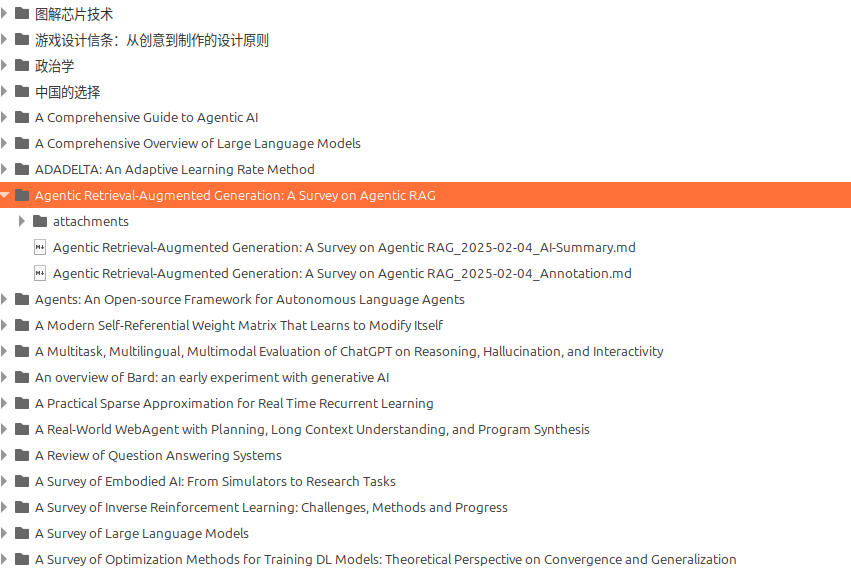

中文 | [英文](README_en.md)

# Zotero AI Workflow

本库提供了一套基于 Zotero 的自动化工作流，包括摘要、问答、生成-更新-导出笔记。worlflow的组件都依赖[zotero-actions-tags](https://github.com/windingwind/zotero-actions-tags) 以JS脚本的形式实现。

## Zotero Workflow Summary
以下是我们使用zotero的基本流程：
- 入库条目
    - [自动]增加#To-Read标签
    - [手动]增加#To-More-Read等标签
- 打开条目
    - [自动]翻译摘要
    - [自动]生成AI摘要，存储到note
- 阅读条目
    - [手动]阅读AI摘要
    - [手动]添加标注
    - [交互]交互AI进行pdf问答,存储到note
- 关闭条目
    - [自动]生成由标注生成的笔记
    - [自动]删除#To-Read
    - [手动]删除#To-More-Read
- 启动zotero程序，打开主window
    - [自动]更新笔记→本地markdown，与外部笔记软件（比如wolai）同步； 7天更新一次
    - [交互]交互AI进行库层面问答,存储到note

## Quick Start
1、下载好库后，启动parser_server: nohup python parse_server.py &
2、依赖better-notes与actions-tags插件 按需配置好这些模板与脚本。
3、cp config_example.json config.json，配置好服务器地址、模型API等信息。注意在代码中修改配置所在的路径、模板名称等。
4、[optional] 配置好prompt，用于配置模型输入的prompt。
然后在zotero触发这些脚本即可。

## 核心逻辑
本库一共提供了以下脚本；功能都是独立的脚本，可以单独使用。

| 脚本文件                  | 功能描述                                     |
|--------------------------|-------------------------------------------|
| zotero_autoupdate_notes.js | 更新指定模板生成的note                      |
| zotero_note_template.js  | 利用标注生成笔记的模板，支持对层次header的提取       |
| zotero_pdf_summary.js    | LLM生成摘要                                    |
| zotero_pdf_qa.js         | LLM问答                                 |
| zotero_export_note.js    | note导出到文件里，方便同步到外部软件           |

## 配置

config.json 用于配置服务器地址、模型API等信息。
```
{
    "server": { 
        "url": "http://127.0.0.1:13210",
        "timeout": 30
    },
    "llm": {
        "openaiBaseUrl": "https://dashscope.aliyuncs.com/compatible-mode/v1",
        "modelName": "qwen-plus-latest",
        "apiKey": "sk-xx",
        "temperature": 0.8
    },
    "summary": {
        "chunkSize": 64000,
        "chunkOverlap": 1000,
        "maxChunk": 50,
        "only_link_file": false,
        "support_item_types": [
            "preprint",
            "journalArticle",
            "magazineArticle",
            "conferencePaper",
            "manuscript",
            "thesis"
        ]
    },
    "qa": {
        "saveColelctionKey":  "IV5MQ9HV"
    }
}
```
- **`serverUrl`**：用于解析 PDF 文件和将总结后的 markdown 转换为 html 的服务器地址。
- **llm**：LLM相关信息
- **`chunkOverlap`**：map-reduce 方案下分片间重合的大小。
- **`only_link_file`**：配合 [ZotMoov](https://github.com/wileyyugioh/zotmoov) 或 [ZotFile](https://github.com/jlegewie/zotfile) 使用。如果使用这两个或类似的插件将论文 PDF 以 Zotero 的 "Link to File" 形式保存，则应设置 `only_link_file` 为 `true`，否则设置为 `false`。
- support_item_types 摘要支持的item类型
- saveColelctionKey 问答保存的collection key


prompt文件夹 用于配置模型输入的prompt。
- **`stuffPrompt`**：当 PDF 文档没有超出模型上下文时使用的提示词。
- **`mapPrompt`**：map-reduce 方案下 map 阶段使用的提示词。当 PDF 文档超出模型上下文时使用，将 PDF 拆分成多个分片，分片LLM总结(map)后再合并交互LLM(reduce)。
- **`reducePrompt`**：map-reduce 方案下 reduce 阶段使用的提示词。
## 利用标注(annotation)生成笔记(note)
官方自带annoation->note的功能，但是不支持对层次header的提取。目前我们使用对Header特殊颜色标注的方式来解决这个问题。更优雅的方案应该是自动识别填充[TODO]。

需要安装better-notes插件，zotero_note_template.js即为笔记模板。zotero_autoupdate_notes.js 为action-tags脚本，会自动更新笔记。


## LLM生成摘要
zotero_pdf_summary.js

在 Zotero 中使用 LLM 自动总结论文并生成笔记。

在 zotero 中打开论文时，zotero-actions-tags 触发 JavaScript 脚本，获取论文的 PDF 文件地址和论文名，并向后台服务parse_server.py发送 PDF 进行解析与分割。之后本地调用 LLM API 总结论文。获得总结后将生成的 markdown 发送给后台服务转换为 html。最后将 html 总结写入到论文笔记中。


## QA流程
zotero_qa.js

使用LLM回答用户提出的问题。逻辑：
- 用户提出问题后，根据问题搜索zotero库中相关的items，将items信息(标题、摘要、摘要、 AI总结)与prompt合并，调用LLM API，返回答案，最后将答案写入到note中。
- 需要增加一个pdf_qa的逻辑，在pdf阅读中，用户提出问题，搜索提取相关片段，调用LLM API，返回答案，最后将答案写入到note中。

nohup python parse_server.py & 最好添加进开机项。

## note导出
zotero_export_note.js
笔记应当是可以搜索的，才在日常中融入到知识处理流程。导出是希望把阅读笔记导入到专门的笔记软件中，方便搜索与使用。

注意在代码中指定导出note的key来匹配。

